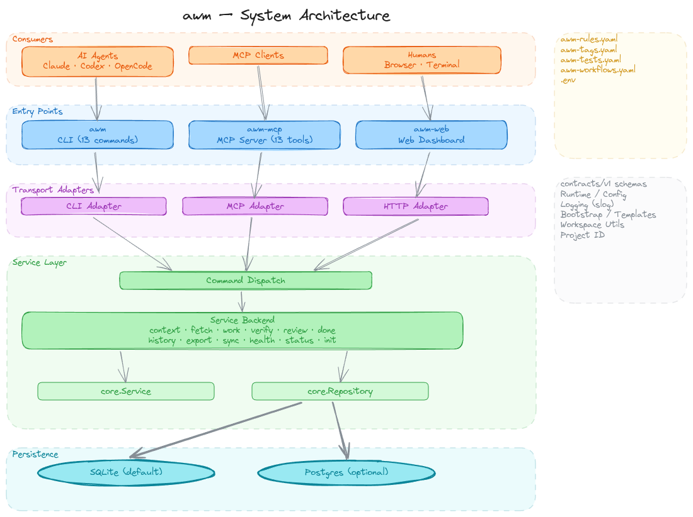

# AWM Architecture

AWM (Agent Workflow Manager) is a repo-owned control plane that provides durable task state and governed workflows for AI coding agents. This document describes the internal structure, request lifecycle, and architectural invariants of the system.

## Overview

AWM is built on a modular, layered architecture designed for parity across multiple transport protocols (CLI, MCP, Web) and storage backends (SQLite, Postgres). It centralizes business logic in a core service layer while maintaining strict boundaries between transport, command dispatching, and data persistence.

<picture>
  <source media="(prefers-color-scheme: dark)" srcset="architecture/awm-architecture-layers-dark.png">
  <source media="(prefers-color-scheme: light)" srcset="architecture/awm-architecture-layers.png">
  
</picture>

## Layer Diagram

The system follows a traditional hexagonal (ports and adapters) approach:

```text
[ Entrypoints ]       cmd/awm, cmd/awm-mcp, cmd/awm-web
                            ↓
[ Adapters (In) ]     internal/adapters/{cli, mcp, http}
                            ↓
[ Dispatcher ]        internal/commands/dispatch.go
                            ↓
[ Service Layer ]     internal/service/backend/ (implements internal/core.Service)
                            ↓
[ Domain Logic ]      internal/core/
                            ↓
[ Adapters (Out) ]    internal/adapters/{sqlite, postgres} (implements internal/core.Repository)
```

## Request Lifecycle

Every AWM operation follows a unified execution flow:

1.  **Ingress**: The entrypoint (e.g., `cmd/awm`) receives input and delegates to the appropriate adapter (e.g., `internal/adapters/cli`).
2.  **Decode and Validate**: The adapter uses `internal/contracts/v1.DecodeAndValidateCommandWithDefaults` to transform raw input into a versioned `CommandEnvelope` and validate the payload against the command catalog.
3.  **Dispatch**: The adapter calls `internal/commands.Dispatch`, which routes the validated payload to the corresponding method on `internal/core.Service`.
4.  **Execution**: `internal/service/backend` implements the business logic, interacting with `internal/core.Repository` for persistence and `internal/core/` for domain rules.
5.  **Result**: The service returns a concrete result type or an `*internal/core.APIError`.
6.  **Egress**: The adapter wraps the result in a `ResultEnvelope` and serializes it for the transport (JSON for MCP/Web, formatted text/JSON for CLI).

## Error Propagation

AWM uses a structured error model to ensure consistent reporting across all interfaces:

*   **Domain Errors**: Represented by `internal/core.APIError`, containing a stable `Code`, human-readable `Message`, and optional `Details`.
*   **Contract Mapping**: The `APIError.ToPayload()` method converts domain errors into `internal/contracts/v1.ErrorPayload`.
*   **Envelope Response**: Errors are returned in the `ResultEnvelope` with `OK: false`. CLI adapters further format these for human readability.

## Storage Parity

AWM supports both SQLite (default for local development) and Postgres (for high-concurrency environments).

*   **Repository Interface**: `internal/core/repository.go` defines the storage contract.
*   **Adapter Parity**: Both `internal/adapters/sqlite` and `internal/adapters/postgres` must implement the repository interface with equivalent semantics.
*   **Migration Lockstep**: Database migrations for both backends move in lockstep. A change to the SQLite schema must be accompanied by an equivalent Postgres migration to maintain the storage parity invariant.

## Command Catalog

The `internal/contracts/v1/command_catalog.go` file is the single source of truth for all AWM operations. It defines:

*   **CLI Metadata**: Subcommand names, usage strings, and help text.
*   **MCP Metadata**: Tool titles and descriptions.
*   **Schema Mapping**: Input and output schema definitions used for validation and MCP tool discovery.
*   **Validation Logic**: Dedicated decode and validation functions for each command payload.

This centralization ensures that CLI flags, MCP tool definitions, and manual JSON requests remain in perfect alignment.

## Binary Entrypoints

*   **`cmd/awm`**: The primary CLI. It handles environment loading, project resolution, and flags, then delegates the heavy lifting to `internal/adapters/cli/run.go`.
*   **`cmd/awm-mcp`**: The Model Context Protocol server. It implements the MCP transport and delegates tool invocations to `internal/adapters/mcp/invoke.go`.
*   **`cmd/awm-web`**: The read-only dashboard. It serves the UI and provides a live view of the task board by calling the same backend service.

## Architectural Invariants

*   **Handlers do not query the database**: Logic is always delegated to the Service layer.
*   **Repositories do not contain transport logic**: Persistence layers are agnostic of whether they are serving a CLI or MCP request.
*   **Main does not absorb business rules**: Entrypoints are thin wrappers for configuration and adapter invocation.
*   **Schema parity**: `internal/contracts/v1` and `spec/v1` must always stay in sync.

For more details on package boundaries and coding patterns, see [CONTRIBUTING.md](../CONTRIBUTING.md). For maintainer workflows, see [AGENTS.md](../AGENTS.md).
